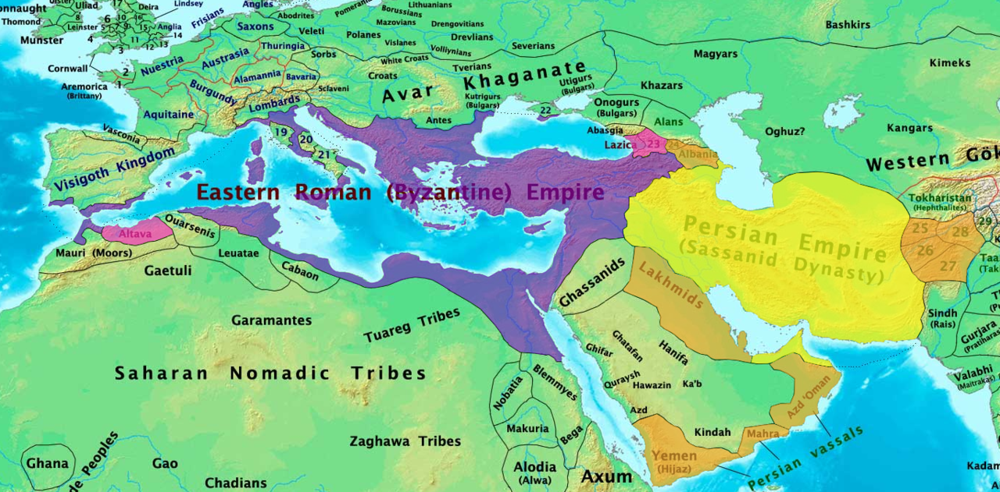

# মহানবী (সাঃ) এর অনবদ্য জীবনী

|                           অধ্যায়                            |                           বিষয়                            |  ভিডিও দেখুন  |
| :---------------------------------------------------------: | :-------------------------------------------------------: | :-----------: |
|                           [00]()                            |                                                       | [Watch Now]() |
|                           [01]()                            |                                                       | [Watch Now]() |
|                           [02]()                            |                                                       |   Watch Now   |
|                           [03]()                            |                                                      |   Watch Now   |
|                           [04](#)                           |                                                      |   Watch Now   |
|                           [05](#)                           |                                                      |   Watch Now   |
|                           [06](#)                           |                                                      |   Watch Now   |
|                             07                              |                                                           |   Watch Now   |
|                             08                              |                                                           |   Watch Now   |
|                             09                              |                                                           |   Watch Now   |
|                             10                              |                                                           |   Watch Now   |
|       [11](#chapter-11-css-position-z-index-overflow)       |              |   Watch Now   |
|        [12](#chapter-12-css-float-display-alignment)        |                |   Watch Now   |
|                [13](#chapter-13-css-flexbox)                |                                |   Watch Now   |
|               [14](#chapter-14-css-selectors)               |                              |   Watch Now   |
|           [15](#chapter-15-css-text-fonts--icons)           |                      |   Watch Now   |
| [16](#chapter-16-css-links-lists-tables-display--max-width) |  |   Watch Now   |
|    [17](#chapter-17-css-image-gallery-and-image-sprites)    |        |   Watch Now   |
|                             18                              |                                                           |   Watch Now   |
|  [19](#chapter-19-visualize-and-play-with-css-properties)   |     |   Watch Now   |
|              [20](#chapter-20-css-grid-layout)              |                            |   Watch Now   |
|               [21](#chapter-21-css-gradient)                |                               |   Watch Now   |
|         [22](#chapter-22-css-2d-and-3d-transforms)          |                   |   Watch Now   |
|              [23](#chapter-23-css-animations)               |                             |   Watch Now   |
|                             24                              |                                                           |   Watch Now   |
|                             25                              |                                                           |   Watch Now   |
|                             26                              |                                                           |   Watch Now   |
|                             27                              |                                                           |   Watch Now   |
|                             28                              |                                                           |   Watch Now   |
|                             29                              |                                                           |   Watch Now   |
|                             30                              |                                                           |   Watch Now   |
|                             31                              |                                                           |   Watch Now   |
|                             32                              |                                                           |   Watch Now   |
|                             33                              |                                                           |   Watch Now   |
|                             34                              |                                                           |   Watch Now   |
|                             35                              |                                                           |   Watch Now   |
|                             36                              |                                                           |   Watch Now   |
|                             37                              |                                                           |   Watch Now   |
|                             38                              |                                                           |   Watch Now   |
|                             39                              |                                                           |   Watch Now   |
|                             40                              |                                                           |   Watch Now   |

# Chapter-01: প্রাচীন আরব

- [আরবের ভৌগলিক অবস্থান ও গোত্র সমূহ](#আরবের-ভৌগলিক-অবস্থান-ও-গোত্র-সমূহ)

## আরবের ভৌগলিক অবস্থান ও গোত্র সমূহ

- **আরব** অর্থ বালুকাময় প্রান্ত বা ঊষর ধূসর মরুভূমি।
- আরবের পশ্চিমে
  

# Chapter-31: কার উপাধী কি ছিল

    <b><a href="#মহানবী-সাঃ-এর-অনবদ্য-জীবনী">↥ Go to Top</a></b>

| **ক্রমিক নং** | **নাম**                 | **উপাধি**                                    | **উপাধির অর্থ**        |
| ------------- | ----------------------- | -------------------------------------------- | ---------------------- |
| 1             | যায়দ বিন হারিসা (রাঃ)   | হিব্বু রসুলুল্লাহ | রসুলুল্লাহর প্রীতিভাজন |
| 2             | খালিদ বিন ওয়ালিদ (রাঃ)  | সাইফুল্লাহ        | আল্লাহ্‌র তরবারি       |
| 3             | আলি বিন আবু তালিব (রাঃ) |                        |                        |
| 4             |                         |                        |                        |
| 5             |                         |                        |                        |
| 6             |                         |                        |                        |
| 7             |                         |                        |                        |
| 8             |                         |                        |                        |
| 9             |                         |                        |                        |
| 10            |                         |                        |                        |

# অধ্যায়-৩২: একনজরে নামে নামে সংক্ষিপ্ত পরিচয়

    <b><a href="#মহানবী-সাঃ-এর-অনবদ্য-জীবনী">↥ Go to Top</a></b>

